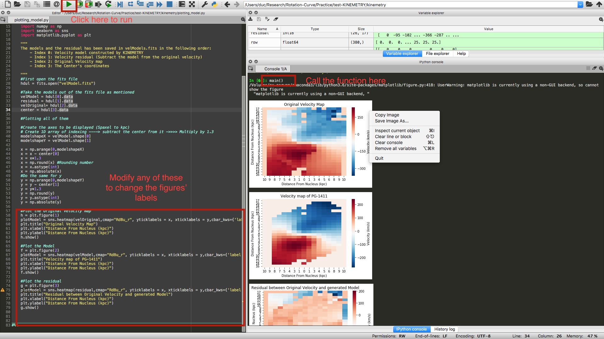

# KINEMETRY-based Galaxy Modelling

The program uses KINEMETRY package to model different dynamical parameters of galaxies. 

## Introduction

KINEMETRY Package was written in IDL by Davor Krajnović. It is primarily a program to carry out "analysis of 2D maps of (kinematic) moments of the line-of-sight-velocity distribution (LOSVD)," and is described in details [here](http://davor.krajnovic.org/idl/#kinemetry).

For the purposes of my research, I ultilized it in order to fit rotation curves and model the velocity fields, which will be displayed using the Python codes that I wrote.

This document is intended for people who want to use my codes to get the properly displayed graphs or beginners who want to develop on this project. 

**NOTE:** At this point I don't know how to use Shell to develop a User Interface (UI). Thus, the following instructions will guide you through each manual step to produce the figures without using a UI. 

## Instructions for absolute beginners
###### I Assumed that the folders in this resporitory has already been downloaded to your computer, and that you're working on MacOS.
1) Open IDL (since IDL might have multiple versions on the computers, the easiest way to directly open the newest version is to type "idlde" to XQuartz or Terminal)

2) Change the directory under "Current Diectory" (Bottom Right Corner) to wherever you saved the downloaded folder.

3) Now you're ready to call some functions in the IDL Console!
    - Note: If you modify something you have to compile everything again before calling it in the console. 
    
4) Call the "galaxy_model_kine" in the console, note that it takes one parameter, which is the name of the data cube. Thus, if the name of the data cube is "pg1411.xdr", you will call it with the following command: galaxy_model_kine, "pg1411.xdr" 
    - Note: With this call, you should already have obtained the rotation curve.
    - During the run, the function also saves the velocity model generated by KINEMETRY, the original velocity map, the residual between them and the center's coordinates in a fits file (velModels.fits). This file will be used later on to generate the plots in Python. 

5) Now that we obtained the fits file, open a IDE of Python of your choice and run the main function in the "plotting_model.py" and your figures are ready!!
    - Note: I don't explicitly save the output figures. However, you can just save them by a single right click on the image. The reason for this is that I want to allow the users to have some freedom to modify the codes before saving the figures of their choice. (You have options to modigy the units and labels of the graphs from my defaults)
    - **Example in Spyder (Anaconda Environment):** 
        - Remember to direct to the right directory that contains the fits file (Which is usually saved in the same folder with the IDL codes)
        - Click the "Play" button (remember to save the file first if you do modify anything)
        - Call "main()" in the console and the figures will appear!
        - Right Click on the figure if you want to save any of them. 

